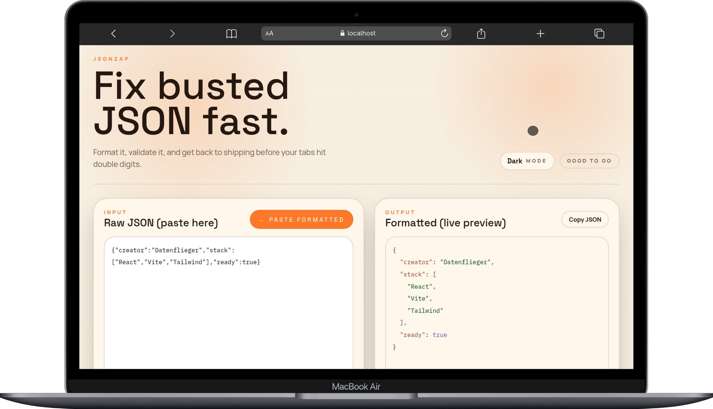
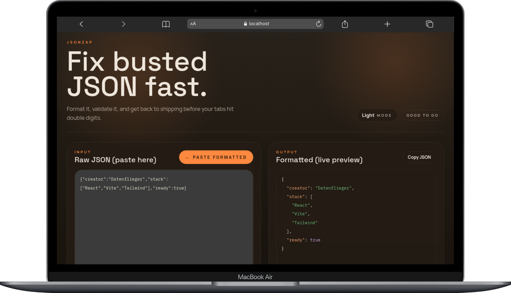
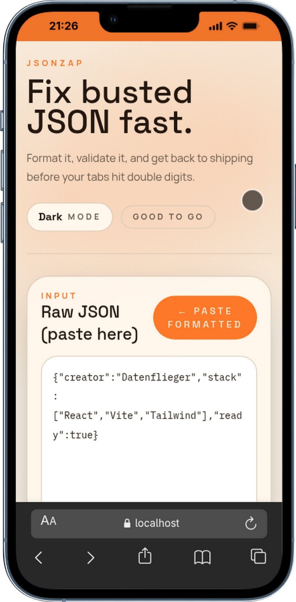
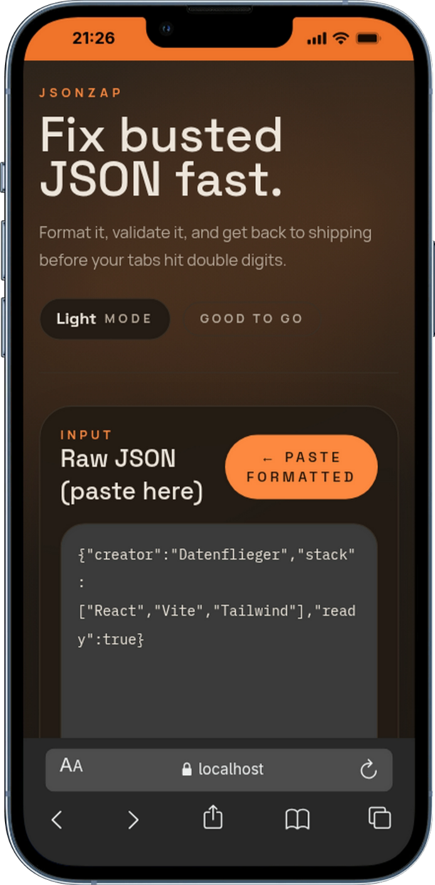

# JsonZap

[](https://github.com/datenflieger/jsonzap/stargazers)
[](https://jsonzap.vercel.app)
[](./LICENSE)

## Fix JSON in 1 click

JsonZap is a fast little JSON formatter for devs who just want the broken payload fixed and out of the way.

## Screenshots

Preview shots:

### Desktop




### Mobile




## Quickstart

```bash
npm i
npm run dev
```

## Deploy

Ship it on Vercel:

[Deploy JsonZap](https://vercel.com/new/clone?repository-url=https://github.com/datenflieger/jsonzap)

## Built with

- React
- Vite
- Tailwind CSS
- Prism.js
